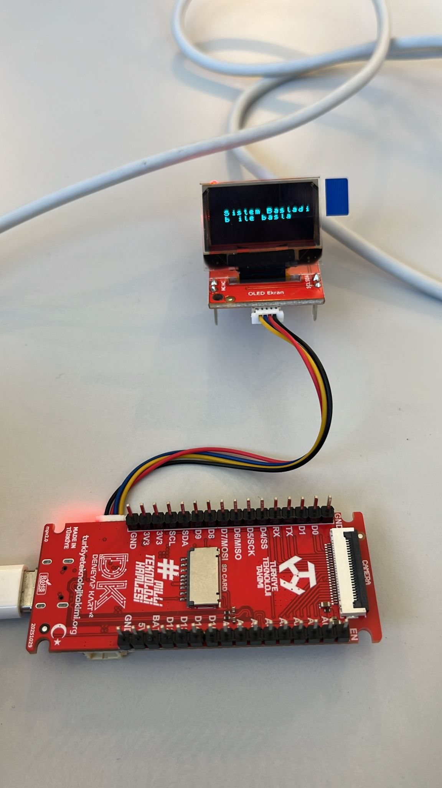

# Deneyapkart OLED Counter

This project is a time-based counter application developed using **Deneyapkart 1A** and an **I2C OLED display**.

The counter is started via serial communication and increases every second using the `millis()` function instead of `delay()`. System states such as start, counting, and completion are displayed on the OLED screen.

## Features
- Non-blocking timing using `millis()`
- Serial command-based control
- OLED display output
- State-based system logic
- Beginner-friendly and educational structure

## How It Works
- The system starts in idle mode.
- When the user sends the **'b'** character via the serial monitor, the counter starts.
- The counter increases every 1 second.
- When the counter reaches a predefined value, the process ends and the system stops counting.

## Hardware Used
- Deneyap Kart 1A
- Deneyap OLED Display
- I2C connection cable

## Circuit
The OLED display is connected to the Deneyap Kart via the I2C interface.

## Notes
This project is designed as an introductory example for users who are new to Deneyap Kart, OLED displays, and non-blocking timing concepts in embedded systems.

